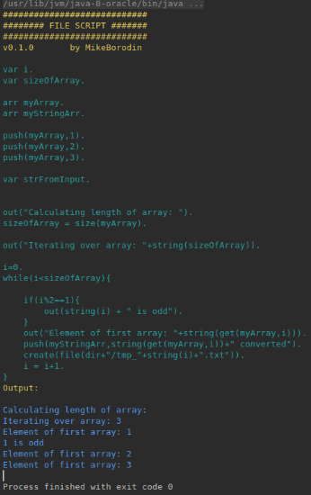

# FileScript

This is project created for learning purposes, but I hope it will be useful for the community.

# How to use 

Compile a .jar and then launch it with a source code file (.fs)

# Capabilities

Interpreter can work with files (basically just a wrapper over Java filesystem API)
You can list files, create, remove, read / write file, append to file.
Also there is a function to count number of lines in a file given or in a whole folder.

Language is not strictly typed, you can assign number to a var and then reassign some string value.
Basic array suport. While/For loops.
You can even create different threads.

  
You can find more examples in file_script_src/

Pull requests are welcome! :)
